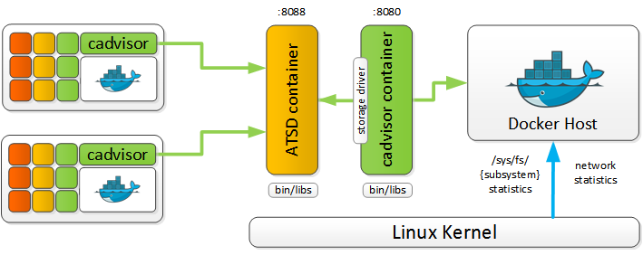
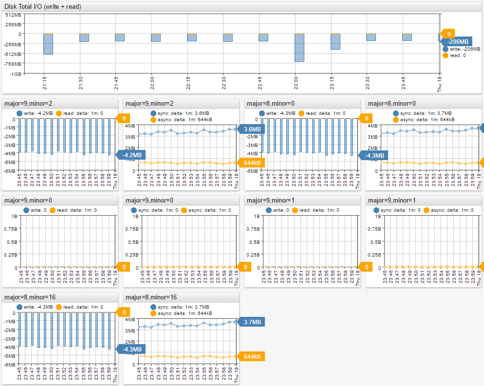
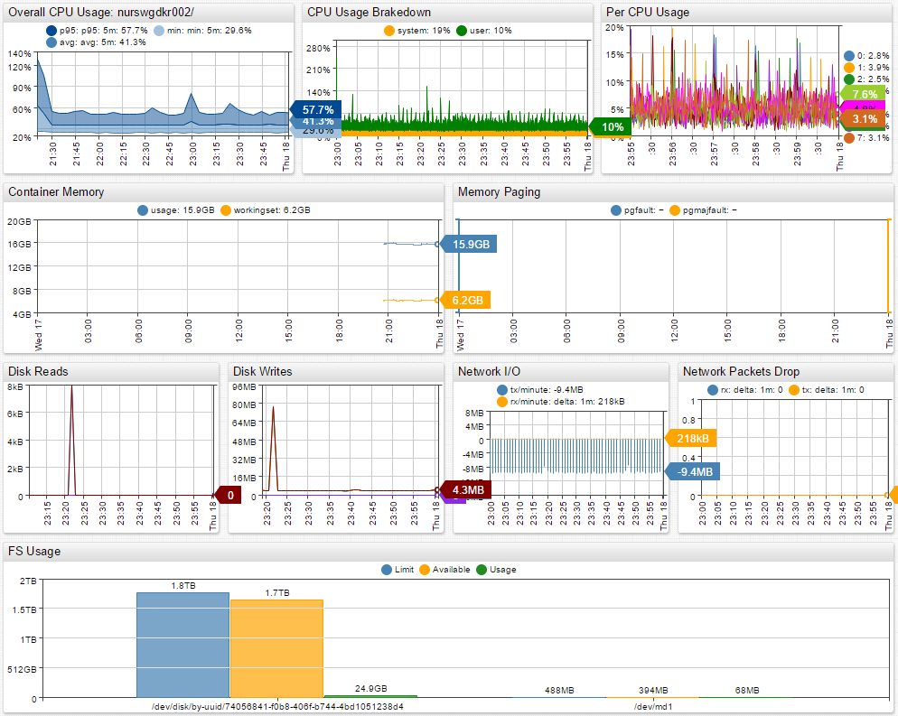
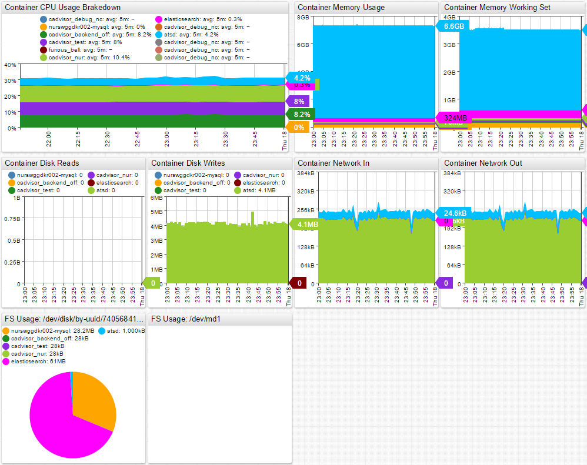
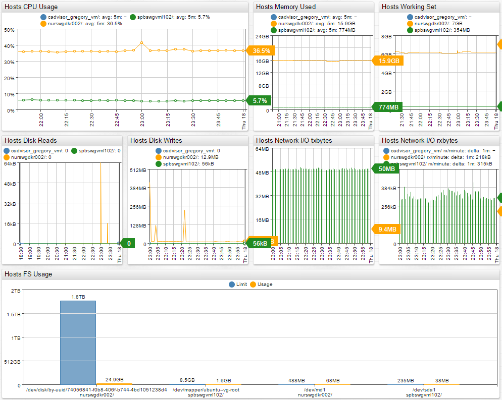

# Installing Axibase Time-Series Database (ATSD) as the backend for cAdvisor 

[Axibase Time Series Database](http://axibase.com/products/axibase-time-series-database/) can collect Docker metrics through cAdvisor for long-term retention, analytics and visualization. A single ATSD instance can collect metrics from many Docker hosts and cAdvisors.

Remote Docker hosts can be easily monitored with multiple cAdvisor instances sending data to a centralized ATSD server. ATSD will store metrics from local and remote Docker hosts for consolidated monitoring and analytics. This type of setup will allow for centralized capacity planning and performance monitoring.



#### Quick Start: Running cAdvisor in a Docker Container with ATSD as the storage driver

If ATSD is not already running, you can start it using:

```
docker run \
  -d \
  -p 8088:8088 \
  -p 8081:8081 \
  -p 8443:8443 \
  -p 8082:8082/udp \
  -h atsd \
  --name=atsd \
  axibase/atsd
```

Launch cAdvisor container with ATSD storage driver:

```
docker run \
  --volume=/:/rootfs:ro \
  --volume=/var/run:/var/run:rw \
  --volume=/sys:/sys:ro \
  --volume=/var/lib/docker/:/var/lib/docker:ro \
  --publish=8080:8080 \
  --detach=true \
  --name=cadvisor \
  --link atsd:atsd \
  google/cadvisor:latest \
  --storage_driver=atsd \
  --storage_driver_atsd_protocol=tcp \
  --storage_driver_host=atsd \
  --storage_driver_buffer_duration=15s \
  --housekeeping_interval=15s 
```

In case you're using http(s) protocol when writing data into ATSD, make sure that you create a collector account with restricted permissions as described [here](https://github.com/axibase/axibase-collector-docs/blob/master/collector-account.md).

```
docker run \
  --volume=/:/rootfs:ro \
  --volume=/var/run:/var/run:rw \
  --volume=/sys:/sys:ro \
  --volume=/var/lib/docker/:/var/lib/docker:ro \
  --publish=8080:8080 \
  --detach=true \
  --name=cadvisor \
  --link atsd:atsd \
  google/cadvisor:latest \
  --storage_driver=atsd \
  --storage_driver_atsd_protocol=http \
  --storage_driver_host=atsd:8088 \
  --storage_driver_user=${ATSD_COLLECTOR_ACCOUNT_NAME} \
  --storage_driver_password=${ATSD_COLLECTOR_ACCOUNT_PASSWORD} \
  --storage_driver_buffer_duration=15s \
  --housekeeping_interval=15s 
```

#### More Options:

Flag                                     | Default Value                           | Description
-----------------------------------------|-----------------------------------------|------------
storage_driver_atsd_protocol             |"tcp"                                    | Transfer protocol. Supported protocols: http, https, udp, tcp
storage_driver_atsd_skip_verify          |false                                    | Controls whether a client verifies the server's certificate chain and host name
storage_driver_atsd_store_major_numbers  |false                                    | Include statistics for devices with all available major numbers
storage_driver_atsd_property_interval    |1m                                       | Container property (host, id, namespace) update interval. Should be >= housekeeping_interval
storage_driver_atsd_sampling_interval    |housekeeping_interval value              | Series sampling interval. Should be >= housekeeping_interval
storage_driver_atsd_docker_host          |content of "/rootfs/etc/hostname" or ""  | Hostname of the docker host, used as entity prefix
storage_driver_atsd_store_user_cgroups   |false                                    | Include statistics for "user" cgroups (for example: docker-host/user.*)
storage_driver_buffer_duration           |1m                                       | Time for which data is accumulated in a buffer before being sent into ATSD
storage_driver_atsd_buffer_limit         |1000000                                  | Maximum network command count stored in buffer before being sent into ATSD
storage_driver_atsd_sender_thread_limit  |4                                        | Maximum thread (goroutine) count sending data to ATSD server via tcp/udp

You can view the collected metrics under the Entity and Metrics tabs in ATSD.
*Note that disk metrics are only collected from containers that have attached volumes.*

#### Built-in Portals:

#### Container Overview Portal


#### Container Disk Detail Portal


#### Docker Host Portal


#### Docker Mutli-Host Portal

